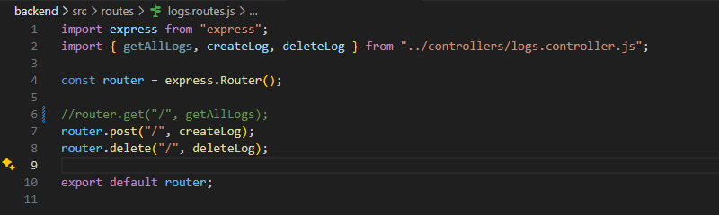

# Incident Report — Habit Tracker

## Incident 1: phát hiện validation hoạt động đúng

| Mục        | Nội dung                                                                |
|------------|-------------------------------------------------------------------------|
| Hiện tượng |POST /api/habits với body rỗng trả về 400 + {"error": "Name is required"}|
| Layer      | L3 Backend                                                              | 
| Nguyên nhân| Thiếu field "name" bắt buộc                                             |
| Cách fix   | Không cần fix — backend đã xử lý đúng                                   |
| Phòng tránh| Frontend phải validate trước khi gửi request                            |
---

## Incident 2: CORS error (sửa file backend/src/app.js)

| Mục         | Nội dung                                                                                                                           |
|-------------|------------------------------------------------------------------------------------------------------------------------------------|
| Hiện tượng  | Frontend hiện "API Offline", 0 habits, Console báo đỏ CORS policy blocked trên tất cả request /api/health, /api/habits, /api/logs. |
| Layer       | L3 Backend                                                                                                                         |
| Nguyên nhân | CORS chỉ cho phép domain 'https://fake-domain123.com', không cho phép 'http://localhost:5001' nên trình duyệt chặn toàn bộ request.|
| Cách fix    | Sửa lại thành app.use(cors()) để cho phép tất cả origin, hoặc whitelist đúng domain frontend.                                      |
| Phòng tránh | Trước khi deploy phải kiểm tra CORS config khớp với domain frontend production.                                                    |

---

## Incident 3: DB connection fail (sửa file backend/src/.env)

| Mục         | Nội dung                                                                                       |
|-------------|------------------------------------------------------------------------------------------------|
| Hiện tượng  | GET /api/habits trả về 500, body báo "password authentication failed for user postgres".       |
| Layer       | L2 External (Database)                                                                         |
| Nguyên nhân | Biến DB_PASSWORD trong file .env bị sai, PostgreSQL từ chối kết nối vì sai thông tin xác thực. |
| Cách fix    | Sửa lại đúng DB_PASSWORD trong file .env rồi restart server.                                   |
| Phòng tránh | - Có file .env.example chuẩn.                                                                  |
                - Kiểm tra kết nối DB ngay sau khi cấu hình biến môi trường.                                   |
                - Không hardcode password trong code.                                                          |