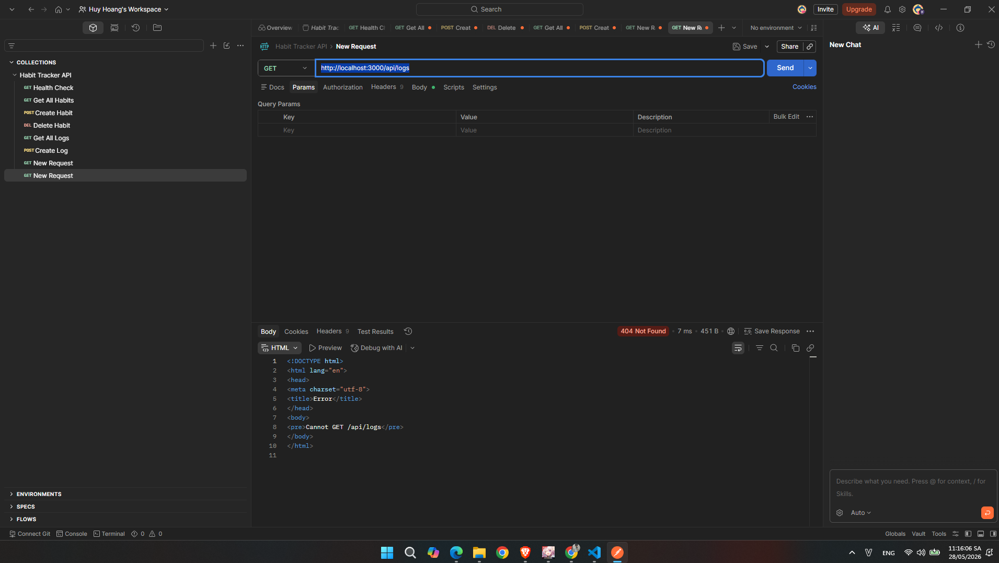
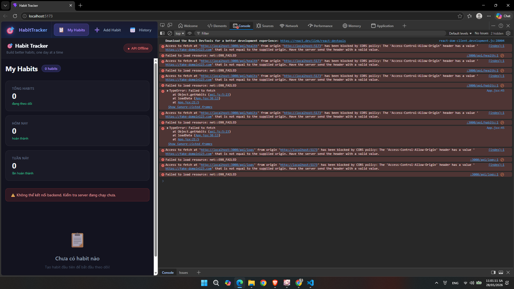
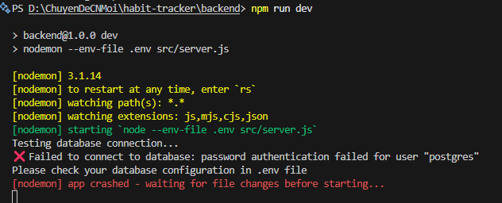
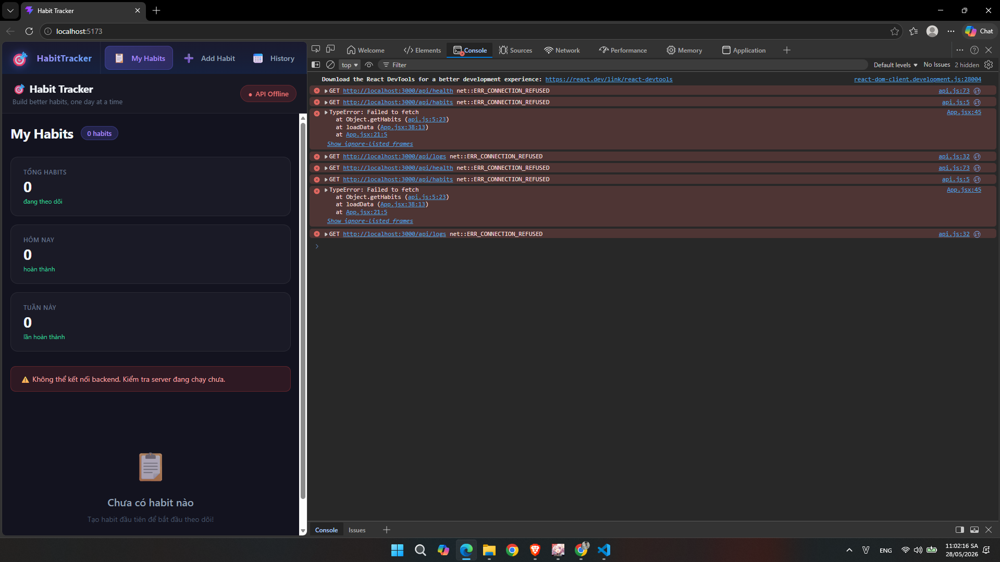

# Incident Report — Habit Tracker

## Incident 1: Missing Route Returns HTML Instead of JSON

[nguyên nhân](images/image.png)

| Mục        | Nội dung                                                                                                 |
|------------|----------------------------------------------------------------------------------------------------------|
| Hiện tượng | GET /api/logs trả về 404 Not Found, Body: "Cannot GET /api/logs" dạng HTML thay vì JSON                  |
| Layer      | L3 Backend                                                                                               | 
| Nguyên nhân| Route GET "/" trong logs.routes.js bị xóa/comment out → server không nhận ra endpoint này → trả về 404   |
| Cách fix   | Thêm lại dòng trong logs.routes.js: router.get("/", getAllLogs), Restart server → endpoint hoạt động lại |
| Phòng tránh| Review kỹ routes trước khi commit                                                                        |
---

## Incident 2: CORS error (sửa file backend/src/app.js)

| Mục         | Nội dung                                                                                                                           |
|-------------|------------------------------------------------------------------------------------------------------------------------------------|
| Hiện tượng  | Frontend hiện "API Offline", 0 habits, Console báo đỏ CORS policy blocked trên tất cả request /api/health, /api/habits, /api/logs. |
| Layer       | L3 Backend                                                                                                                         |
| Nguyên nhân | CORS chỉ cho phép domain 'https://fake-domain123.com', không cho phép 'http://localhost:5001' nên trình duyệt chặn toàn bộ request.|
| Cách fix    | Sửa lại thành app.use(cors()) để cho phép tất cả origin, hoặc whitelist đúng domain frontend.                                      |
| Phòng tránh | Trước khi deploy phải kiểm tra CORS config khớp với domain frontend production.                                                    |
---

## Incident 3: DB connection fail (sửa file backend/src/.env)

| Mục         | Nội dung                                                                                       |
|-------------|------------------------------------------------------------------------------------------------|
| Hiện tượng  | GET /api/habits trả về 500, body báo "password authentication failed for user postgres".       |
| Layer       | L2 External (Database)                                                                         |
| Nguyên nhân | Biến DB_PASSWORD trong file .env bị sai, PostgreSQL từ chối kết nối vì sai thông tin xác thực. |
| Cách fix    | Sửa lại đúng DB_PASSWORD trong file .env rồi restart server.                                   |
| Phòng tránh | Có file .env.example chuẩn, kiểm tra kết nối DB ngay sau khi cấu hình biến môi trường.         |
---